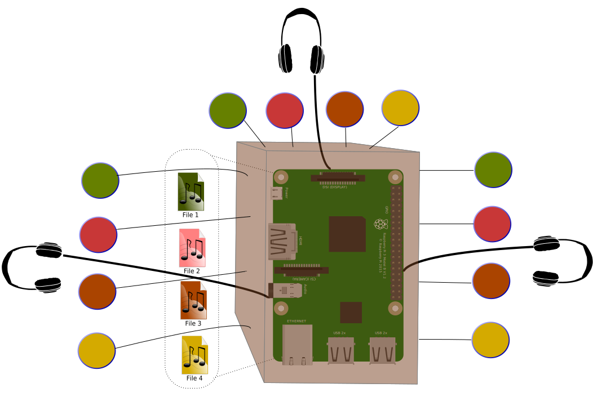

## Pi-ASMR
The Pi-ASMR project transforms a raspberry pi into a Multi-user audio booth.

At the moment, we support n=3 users. We assume that each user can use his/her own headphones in order to listen to different tracks -- independent of what others are listening to. Each user has his/her own 4 buttons to select between 4 different audio tracks residing on the Pi's file-system accordingly.

### Hardware requirements
* Raspberry PI 3 following [this GPIO numbering scheme](./rpi-gpio.png)
* 3 audio dongles connected to the PI via USB.

### Software requirements
* Python 2.7.
* Raspberry PI python library: RPi.
* mpg123 audio player.

### Configuration
* The 3 audio dongles are labeled as hw:1,0 to hw:3,0 in ALSA accordingly.
    * See: https://superuser.com/questions/53957/what-do-alsa-devices-like-hw0-0-mean-how-do-i-figure-out-which-to-use/53977#53977
* Adjust the volumes of the devices using `alsa-mixer` as necessary.
* Create the directory `/home/pi/asmr` if it does not exist and move all the audio files there.
* Adjust `AUDIO_FILENAMES` in the python file `buttons.py` to include the names of your four audio files.

### How to run
1. Clone this repository onto your RPi.
2. `cd tedxdd-18-asmr`
3. `python2 buttons.py`
